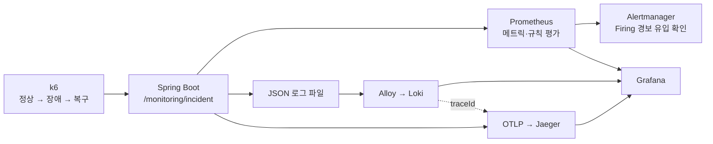

# Open Mission — Observability Incident Drill

Spring Boot 애플리케이션에 의도적으로 오류와 지연을 주입하고, **메트릭 탐지 → 경보 발생 → 구조화 로그 확인 → 동일 traceId의 트레이스 분석 → 복구 확인**까지 한 흐름으로 재현한 관측 가능성(Observability) 실험입니다.

이 프로젝트의 수치는 운영 트래픽 성과가 아니라, 작은 로컬 환경에서 관측 흐름을 반복 검증하기 위한 **통제 장애 훈련 결과**입니다.

## 해결하려던 문제

API가 느려지거나 5xx 오류가 발생했을 때 단일 대시보드만으로는 다음 질문에 답하기 어렵습니다.

1. 언제부터 어떤 이상 징후가 발생했는가?
2. 임계치를 넘은 상태가 실제 경보로 전환됐는가?
3. 문제 요청의 로그와 실행 경로를 같은 식별자로 연결할 수 있는가?
4. 정상 트래픽으로 돌아온 뒤 경보가 해제됐는가?

이를 검증하기 위해 `monitoring-demo` 프로필에서만 활성화되는 전용 API를 만들고, k6로 정상→장애→복구 구간을 재현했습니다.

| 모드 | 동작 | 기대 응답 |
|---|---|---|
| `NORMAL` | 정상 요청 처리 | 204 |
| `ERROR` | 통제된 downstream 오류 발생 | 500 |
| `SLOW` | child span 내부에 1.5초 지연 주입 | 204 |

## 관측 흐름



- Prometheus: HTTP 5xx 비율과 커스텀 지연 히스토그램 수집, 경보 규칙 평가
- Alertmanager: Prometheus가 전달한 `Firing` 경보의 로컬 route 유입 확인
- Alloy + Loki: JSON 로그 수집 및 `traceId`를 structured metadata로 저장
- OpenTelemetry + Jaeger: 요청과 모의 downstream 구간을 span으로 추적
- Grafana: 메트릭과 로그를 함께 탐색하고 `traceId` 링크로 Jaeger trace에 이동
- k6: 응답 시간에 종속되지 않는 일정 요청률로 실험 구간 재현

## 실제 검증 결과

2026-07-29 로컬 Docker 환경에서 전체 시나리오를 수동 확인했고, 2026-07-30에는 검증 스크립트로 같은 흐름을 다시 실행했습니다.

| 검증 항목 | 결과 |
|---|---|
| 총 HTTP 요청 / 상태 코드 check | 873건 / 873건 check 통과 |
| 의도된 500 응답 포함 전체 실패율 | 6.98% (61/873) |
| k6 SLOW 요청 p95 | 1.50초 |
| Prometheus 관측 최대 5xx 비율 | 약 14.29% |
| Prometheus incident 전체 timer 최대 p95 | 약 1.66초 |
| Prometheus rule 상태 | 5xx·p95 두 규칙 모두 `Firing`, 복구 후 `Pending`·`Firing` 0건 |
| Alertmanager | 같은 두 경보의 active 유입과 복구 후 0건 확인, 외부 전달 미구성 |
| ERROR 추적 | Loki 오류 로그의 `traceId`로 Jaeger의 오류 요청 3개 span 확인 |
| SLOW 추적 | `delayMs=1500` 로그와 같은 trace의 downstream child span 1.501초 확인 |


수치의 조건과 확인 방법은 [`docs/experiment-results.md`](./docs/experiment-results.md)에 기록했습니다.

## 빠른 실행

### 1. 모니터링 스택 실행

```bash
docker compose up -d
```

### 2. 애플리케이션 실행

```bash
./gradlew bootRun --args='--spring.profiles.active=monitoring-demo'
```

모니터링 실험 프로필은 기존 8080 포트와 충돌하지 않도록 `18080`을 사용합니다.

### 3. 준비 상태 확인

```bash
curl -fsS http://localhost:18080/actuator/health
curl -fsS http://localhost:9090/-/ready
curl -fsS http://localhost:9093/-/ready
curl -fsS http://localhost:3100/ready
curl -fsS http://localhost:12345/-/ready
```

### 4. 장애 훈련과 관측 신호 자동 검증

```bash
observability/scripts/verify-incident-drill.sh
```

스크립트는 k6를 실행하면서 Prometheus rule 상태, Alertmanager 유입, Loki 로그의 `traceId`, Jaeger span, 복구 후 활성 경보 0건을 함께 판정합니다.

### 5. 관찰 화면

- Grafana: <http://localhost:3000> (`admin` / `admin`)
- Prometheus: <http://localhost:9090>
- Alertmanager: <http://localhost:9093>
- Jaeger: <http://localhost:16686>

Grafana의 `Open Mission / Incident Drill` 대시보드는 provisioning으로 자동 등록됩니다.

## 문서

- [실행 및 관찰 가이드](./docs/monitoring-guide.md)
- [실험 조건과 실제 결과](./docs/experiment-results.md)

## 로컬 실험의 범위

- `Pending`·`Firing`·`Inactive`는 Prometheus가 평가합니다. Alertmanager는 `Firing` 경보의 로컬 유입까지만 확인했으며 Slack·이메일 같은 외부 수신자는 연결하지 않았습니다.
- Jaeger는 로컬 재현성을 위한 all-in-one 메모리 저장소를 사용하므로 장기 보관 구성이 아닙니다.
- 임계치는 운영 SLO가 아니라 2분 30초 실험에서 상태 전이를 관찰하기 위한 값입니다.
- `monitoring-demo` 프로필을 사용하지 않으면 장애 주입 API가 노출되지 않습니다.
- Compose로 실행하는 관측 UI와 DB의 host 포트는 `127.0.0.1`에만 바인딩합니다.
- 실제 외부 시스템 대신 예외와 `Thread.sleep`으로 downstream 오류·지연을 통제 주입한 단일 인스턴스 실험입니다.
- 최초 수동 실행에서 얻은 873건은 처리 용량이나 TPS 성과를 의미하지 않습니다.
