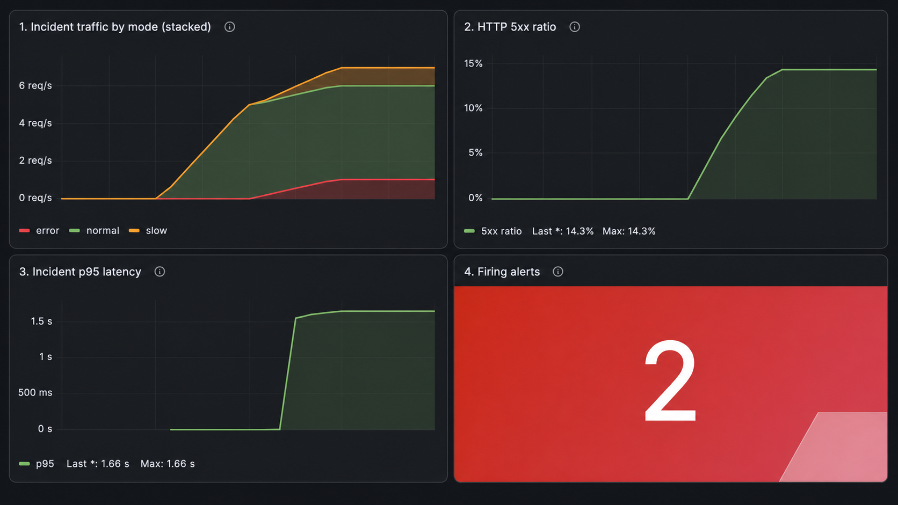
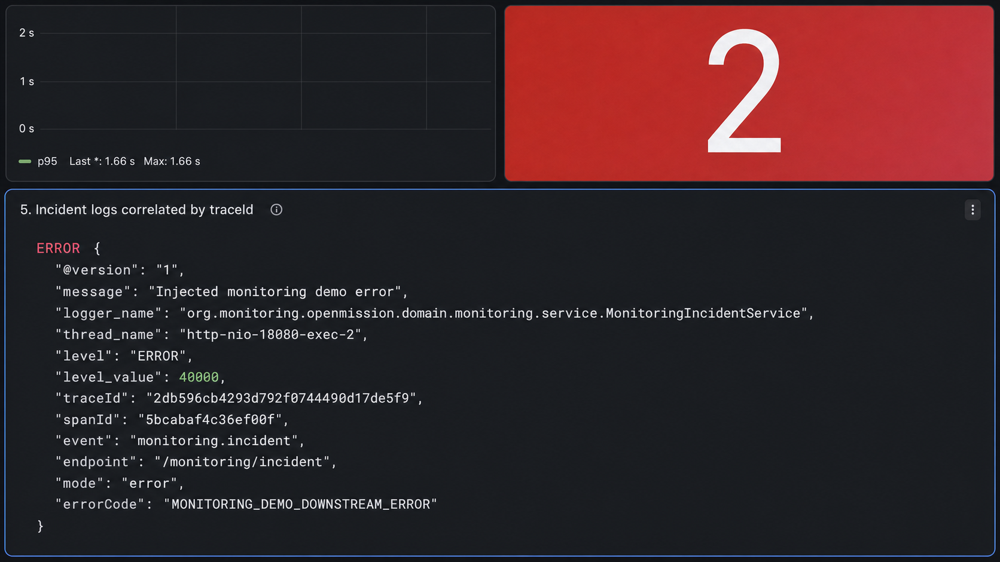
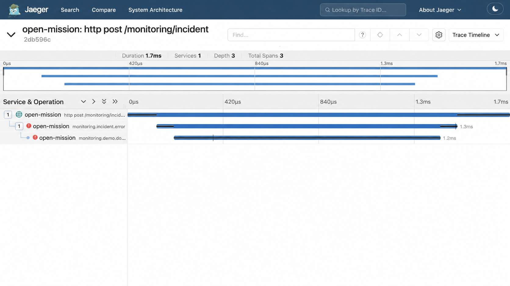
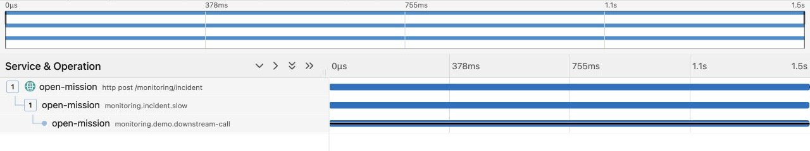

# Incident Drill Experiment Results

## 실험 개요

- 수동 확인: 2026-07-29
- 자동 검증 재실행: 2026-07-30
- 환경: macOS 호스트의 Spring Boot 애플리케이션 + Docker Compose 관측 스택
- 애플리케이션 프로필/포트: `monitoring-demo` / `18080`
- 실행기: k6 `constant-arrival-rate`
- 전체 구간: 2분 30초
- 목적: 대규모 트래픽 처리가 아니라 정상→장애→복구 상태에서 관측 신호가 서로 연결되는지 검증

## 시나리오

| 구간 | 요청 구성 |
|---|---|
| 0~30초 | NORMAL 5 RPS |
| 30~90초 | NORMAL 5 RPS + ERROR 1 RPS + SLOW 1 RPS |
| 90~150초 | NORMAL 5 RPS |

ERROR는 의도적으로 500을 반환하고, SLOW는 child span 안에서 1.5초 대기한 뒤 204를 반환하도록 구성했습니다.

## 실행 결과

### k6

| 항목 | 측정값 | 판정 |
|---|---:|---|
| 총 요청 | 873 | 완료 |
| check | 873/873, 100% | `rate > 99%` 통과 |
| HTTP 실패 | 61/873, 6.98% | 의도한 ERROR 응답이며 `rate < 20%` 통과 |
| SLOW p95 | 1.50초 | `1초 < p95 < 2.5초` 통과 |

`http_req_failed`는 예상하지 못한 장애가 아니라 k6가 HTTP 500을 실패로 분류한 값입니다. 별도 check에서는 ERROR 모드가 500을 반환해야 성공하도록 검증했으며 모든 check가 통과했습니다.

전체 구간 실패율 6.98%와 아래의 최대 5xx 비율 14.29%는 서로 다른 범위의 값입니다. 전자는 2분 30초 전체 요청을 분모로 계산한 k6 결과이고, 후자는 오류 주입 구간이 포함된 Prometheus 30초 rolling window의 최댓값입니다.

### Prometheus rule 상태와 Alertmanager 유입

| 항목 | 측정값 |
|---|---:|
| 최근 30초 최대 5xx 비율 | 0.142857..., 약 14.29% |
| incident 전체 커스텀 timer 최대 p95 | 약 1.664초 |
| Prometheus `MonitoringDemoHigh5xxRate` | `Firing` 확인 |
| Prometheus `MonitoringDemoHighP95Latency` | `Firing` 확인 |
| Alertmanager local route | 같은 두 경보의 active 유입 확인 |
| 복구 구간 이후 | Prometheus `Pending`·`Firing` 0건, Alertmanager active 0건 |

`Pending`·`Firing`·`Inactive` 상태는 Prometheus가 평가합니다. 두 규칙 모두 조건을 15초 이상 유지한 뒤 `Firing`으로 전환됐고, 그 상태가 Alertmanager의 local route에 유입됐습니다. 오류·지연 주입이 끝난 뒤 30초 관측 창이 정상 요청으로 채워지면서 Prometheus의 활성 상태와 Alertmanager의 active 목록이 모두 0건으로 돌아왔습니다.

k6의 SLOW p95 1.50초는 클라이언트가 SLOW 시나리오만 집계한 값입니다. Prometheus의 약 1.664초는 NORMAL·ERROR·SLOW가 포함된 incident 전체 server timer histogram을 30초 구간으로 계산하면서 bucket 사이를 보간한 값입니다. 모집단, 측정 계층, 계산 방식이 모두 다르므로 같은 수치처럼 표현하지 않았습니다.

장애 구간에는 5xx 14.3%, p95 1.66초와 함께 두 경보가 `Firing` 상태인 것을 확인했습니다.

복구 구간이 끝난 뒤에는 같은 대시보드에서 최대값 이력은 유지하면서 활성 경보가 0건으로 돌아온 것을 확인했습니다.

### Loki 로그와 Jaeger 트레이스

Loki에서 `normal`, `error`, `slow` 세 모드의 `monitoring.incident` JSON 로그가 수집된 것을 확인했습니다. `traceId`와 `spanId`는 stream label이 아니라 structured metadata로 저장됐습니다.

오류 로그 표본의 traceId `2db596cb4293d792f0744490d17de5f9`를 Jaeger에서 조회해 다음 실행 경로를 확인했습니다.

1. HTTP `POST /monitoring/incident` root span
2. `monitoring.incident.error` span
3. `monitoring.demo.downstream-call` child span
4. 로그의 spanId와 동일한 오류 span 및 `error.code` tag

따라서 “지표에서 이상 구간 발견 → 오류 로그 선택 → traceId로 해당 요청의 실행 경로 확인” 흐름이 실제 데이터로 연결됐습니다.

강화한 검증 조건으로 다시 실행했을 때 SLOW 로그의 traceId `749dd4116455ade6cb524f98a523a80b`를 Jaeger에서 조회했습니다. 다음 세 span이 하나의 trace에 있었고 `monitoring.demo.downstream-call`은 1.501초였습니다.

1. HTTP `POST /monitoring/incident` root span
2. `monitoring.incident.slow` span
3. `monitoring.demo.downstream-call` child span

따라서 오류 흐름과 별개로 “p95 이상 구간 → `delayMs=1500` SLOW 로그 → 같은 요청의 약 1.5초 child span”도 연결했습니다.

> 공개 문서용 이미지는 절대 날짜·시각 영역만 가리거나 화면 범위에서 제외했습니다. 측정 수치와 식별자는 변경하지 않았습니다.

## 관측 체인 자동 검증

`observability/scripts/verify-incident-drill.sh`가 k6를 실행하면서 Prometheus·Alertmanager·Loki·Jaeger API를 함께 조회합니다. 조건을 충족하지 못하면 non-zero로 종료합니다.

2026-07-30 전체 재실행에서 다음 항목이 모두 통과했습니다.

- Prometheus의 5xx·p95 두 규칙 `Firing`
- Alertmanager local route에 같은 두 경보 active 유입
- k6 HTTP check와 latency threshold
- 복구 후 Prometheus `Pending`·`Firing` 0건, Alertmanager active 0건
- 이번 실행 이후 Loki ERROR·SLOW 로그에서 각각 `traceId` 추출
- 두 trace 모두 HTTP root, `monitoring.incident.*`, `monitoring.demo.downstream-call`의 3개 span 확인
- SLOW downstream child span 1.501초

검증 표본은 ERROR traceId `752d0dcedcc048a12d9a9e3f5ead008e`, SLOW traceId `749dd4116455ade6cb524f98a523a80b`였습니다. traceId 자체가 성과는 아니며, 스크립트가 같은 실행 구간의 로그와 trace를 연결했다는 재현 근거로만 기록했습니다.

## 함께 통과한 검증

- `./gradlew test`
- 실제 `MonitoringIncidentService`를 연결한 컨트롤러 테스트에서 NORMAL 204, ERROR 500, SLOW 1.5초 지연 후 204 확인
- `docker compose config --quiet`
- `bash -n observability/scripts/verify-incident-drill.sh`
- Prometheus config와 alert rule의 `promtool` 검사
- Alertmanager config의 `amtool` 검사
- Loki `-verify-config=true`
- Alloy `validate`
- Grafana의 Prometheus·Loki·Jaeger 데이터 소스 provisioning
- Grafana의 기존 대시보드와 Incident Drill 대시보드 provisioning
- Prometheus target `UP`
- Loki 구조화 로그 수집
- Jaeger OTLP trace 수집

## 해석과 한계

이번 실험으로 입증한 것은 높은 트래픽을 처리한 성능이 아니라 다음 세 가지입니다.

1. 의도한 오류율과 지연을 코드로 반복 재현할 수 있다.
2. Prometheus rule 상태 전이와 Alertmanager의 local route 유입 및 복구를 자동 판정할 수 있다.
3. ERROR와 SLOW 로그의 traceId를 이용해 각각 같은 요청의 오류 span과 지연 span까지 추적할 수 있다.

Alertmanager 외부 receiver, 운영 SLO, 장기 저장소, 보안·권한, 대규모 부하 한계는 검증 범위에 포함하지 않았습니다. 실제 외부 시스템 대신 `simulated-inventory-service` child span 안에서 예외와 `Thread.sleep`을 사용했습니다. 로컬 단일 Spring Boot 인스턴스와 단일 노드 관측 스택을 두 차례 실행한 결과이므로 처리 용량이나 운영 안정성을 증명하지 않습니다.
